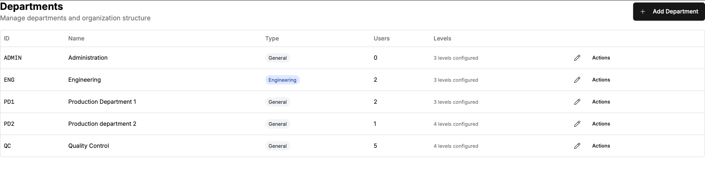
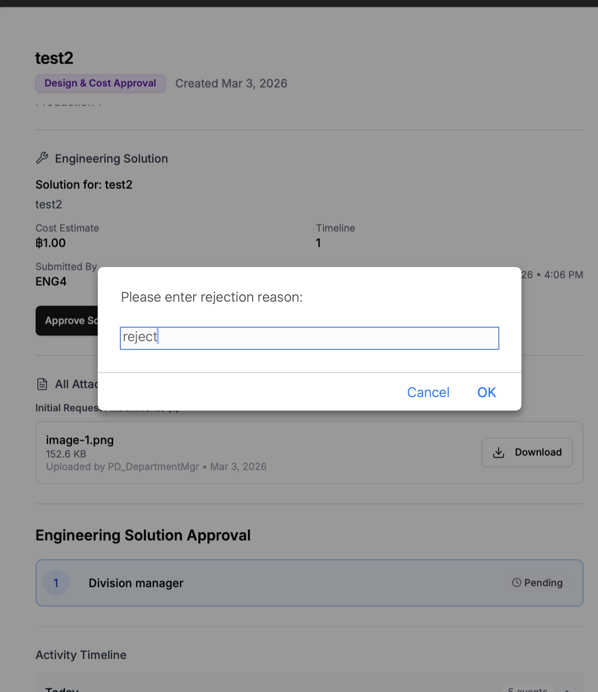

- after approve and status change in overlay window, but main window not change, has to refresh then it change
- test visibility of multi-department user
- test 13: after cancelled it shouldn't shown any reject.because it cancelled
- pending test 14: Requester cancel request at any status with no approving.

## admin/departments , admin/users,  page was not beauty as before 

## Improve UI/UX in detail modal
1. Approve/Reject/resubmit botton style not same in each stage of detail modal[improvement request,engineer solution,FinalApproval] The style of botton is.....
2. Activity timeline should default retract or hide.
3. Modify 'Export PDF' button easy to find

add filter PIC engineer

-resubmit should remember the previous data filled(work) and custom hierarchy setting(if any)
-/requests and /dashboard_pending my approval sector reject solution badge(x) stuggle even after approved.
-design /analytics page i think it's not beauty and useless. use skill
navbar of engineer