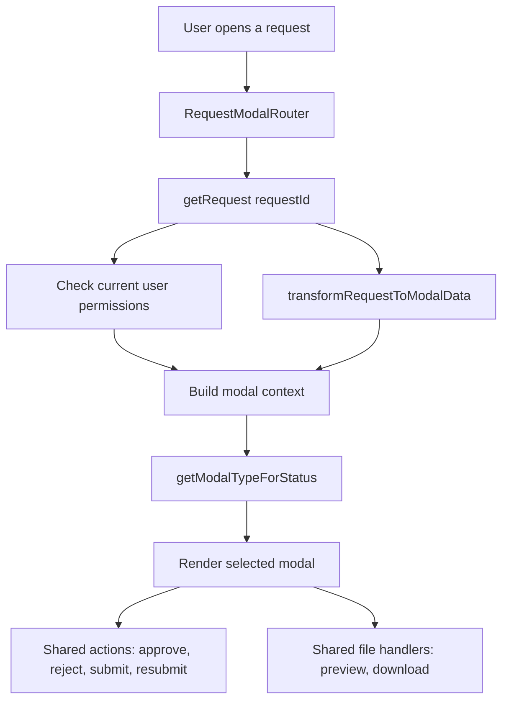

# Request Modal Flow

This document explains how the request modals are connected. It is meant for humans debugging the app, especially when a status changes and a different modal appears than expected.

## Main Idea

Most request screens do not open a modal directly. They open `RequestModalRouter`, and the router decides which modal component should be shown.

The important files are:

- `src/components/requests/request-modal-router.tsx`
- `src/lib/permission-checks.ts`
- `src/lib/modal-data-adapters.ts`
- `src/components/requests/*-modal.tsx`

## High-Level Flow

## Router Responsibilities

`RequestModalRouter` is the connection point for the modal system.

It handles:

- Loading the full request record with `getRequest(requestId)`.
- Checking whether the current user can approve the current stage.
- Checking the user's department type and department id.
- Loading available users for custom approval chains.
- Detecting whether the current request has a relevant rejection.
- Converting database-shaped data into modal-shaped data.
- Selecting the modal with `getModalTypeForStatus(...)`.
- Passing common handlers into each modal.

Common handlers include:

- Request approval: `approveRequest`, `rejectRequest`
- Solution approval: `approveSolution`, `rejectSolution`
- Final approval: `approveFinalApproval`, `rejectFinalApproval`
- Solution submission: `submitSolution`, `resubmitSolution`
- Final approval start or restart: `initiateFinalApproval`
- Request resubmission: `resubmitRequest`
- Attachment preview and download handlers

## Data Adapter

`transformRequestToModalData` in `src/lib/modal-data-adapters.ts` converts the server response into props that modal components understand.

It builds:

- Request submitter details
- Request attachments
- Solution details and solution attachments
- Activity timeline rows
- Approval stages
- Rejection details for the current workflow stage
- Final approval metadata, such as initiated by, current level, total levels, and next approver

The adapter separates approval stages into:

- Improvement request approval
- Design and cost approval
- Final approval

## Modal Selection

`getModalTypeForStatus` in `src/lib/permission-checks.ts` maps request status plus user context to a modal type.

| Request state | Main condition | Modal rendered |
| --- | --- | --- |
| `ImprovementRequest` | Normal request approval | `ApproverModal` with `mode="request"` |
| `ImprovementRequest` or `RequestRejected` | Request has rejection | `RequestResubmitModal` |
| `SentToEngineer` | Engineering user can submit solution | `CompletedRequestModal` with submit-solution action |
| `SentToEngineer` | Non-engineering user | `CompletedRequestModal` read-only |
| `SentToEngineer` | Final approval rejection sent work back to engineering | `SolutionModal` in resubmit flow |
| `DesignCostEstimationApproval` | Solution waiting for approval | `SolutionModal` |
| `DesignCostEstimationApproval` or `SolutionRejected` | Solution has rejection | `SubmitterModal` resubmit-solution flow |
| `SendBackToRequester` | Requester department can start final approval | `CompletedSolutionModal` with submit-final-approval action |
| `SendBackToRequester` | Other users | `CompletedSolutionModal` read-only |
| `FinalApproval` | Final approval initiated | `ApproverModal` with `mode="final"` |
| `FinalApproval` or `FinalRejected` | Final approval rejected | `FinalApprovalResubmitModal` |
| `Completed` | Workflow finished | `CompletedFinalModal` |

Important detail: after final approval is initiated, the app does not use `SubmitFinalApprovalModal` anymore. It uses `ApproverModal` with `mode="final"`.

## Modal Components

The router can render these request modal components:

- `SubmitterModal`: creates or resubmits request or solution content.
- `ApproverModal`: reviews request approval and final approval. In final mode, it shows solution details, final approval status, attachments, and approve/reject actions when allowed.
- `CompletedRequestModal`: shows the approved request after it is sent to engineering.
- `SolutionModal`: shows engineering solution review and solution approval flow.
- `CompletedSolutionModal`: shows approved solution before final approval is initiated.
- `SubmitFinalApprovalModal`: starts the final approval chain from the requester department.
- `FinalApprovalResubmitModal`: restarts final approval after a final approval rejection.
- `CompletedFinalModal`: shows the completed workflow.
- `RequestResubmitModal`: resubmits an initial request after request rejection.

## File Preview Wiring

File preview is centralized in `RequestModalRouter`.

The router owns:

- `previewFile`
- `previewUrl`
- `previewOpen`
- `handlePreviewFile(fileId)`
- `handlePreviewSolutionFile(fileId)`
- `handleDownloadFile(fileId)`
- `handleDownloadSolutionFile(fileId)`

The preview handlers find the file in the loaded request data, normalize its stored path, and open `FilePreviewDialog`.

The router passes preview handlers into every modal that displays attachments:

- Request attachment preview: `onPreviewFile={handlePreviewFile}`
- Solution attachment preview: `onPreviewSolutionFile={handlePreviewSolutionFile}`

When adding a new modal that displays request or solution attachments, wire these props too. Otherwise the file name or preview icon may render without opening the preview dialog.

## File URL Helpers

File path and preview behavior lives in `src/lib/file-preview.ts`.

The helper functions:

- Normalize stored file paths.
- Remove leading slashes and `public/` prefixes.
- Build inline preview URLs for `/api/files/download`.
- Detect whether a file can be previewed as PDF, image, text, DOCX, or XLSX.

The download API route is `src/app/api/files/download/route.ts`.

It supports:

- Download behavior by default.
- Inline preview behavior with `disposition=inline`.

## Common Debug Checklist

When a modal or preview does not work:

1. Check the request `status` in the database or API response.
2. Check whether the request has a relevant rejection for the current stage.
3. Check the user's department and approval permission.
4. Confirm what `getModalTypeForStatus` returns for that combination.
5. Check the router switch case for that modal type.
6. Confirm the modal receives the needed callback props.
7. For file preview, confirm both request and solution attachment props are wired if the modal shows both attachment groups.
8. Rebuild the Docker app if testing on `localhost:3000`, because that port serves the production container.

## Regression Coverage

`tests/regression/file-preview.test.ts` protects the preview wiring.

It checks:

- Supported preview file kinds.
- URL normalization for stored file paths.
- Router preview handler wiring.
- Modal preview prop support for the modals that display request and solution attachments.

If a new attachment modal is added, add it to this test so preview wiring cannot be missed again.
